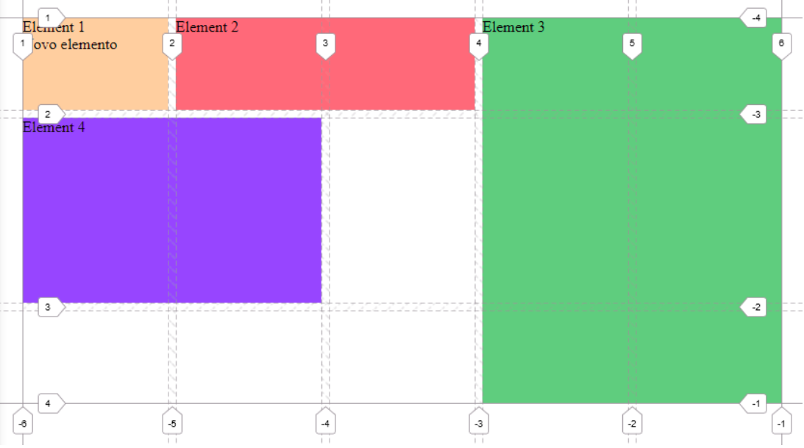
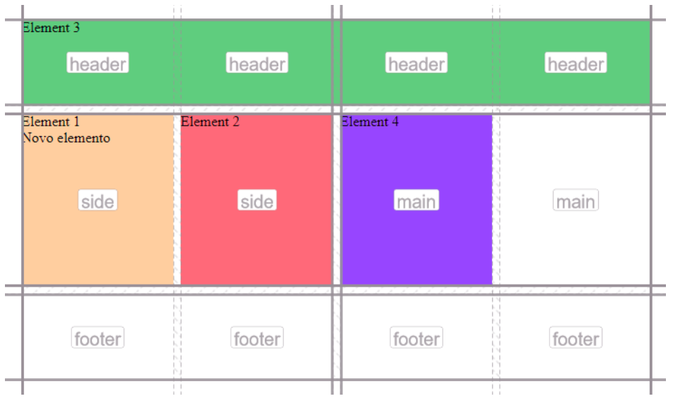
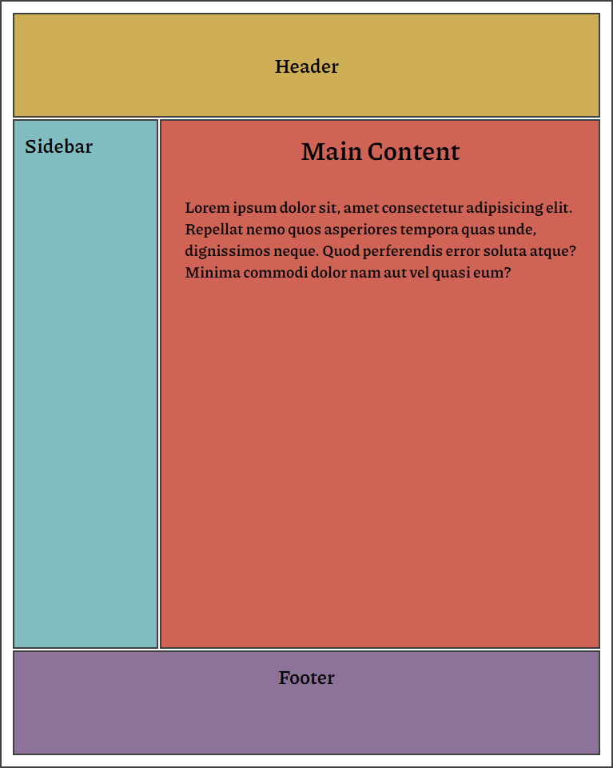

## CSS Grid Practice

### Objective

Build a simple web template with **CSS Grid** to understand all its properties and functionalities.

### Properties analyzed

- _grid-template-colums_
- _grid-template-rows_
- _grid-column-start_
- _grid-column-end_
- _grid-row-start_
- _grid-row-end_
- _grid-column (shorthand)_
- _grid-row (shorthand)_
- _grid-area (shorthand)_
- _column-gap_
- _row-gap_
- _gap (shorthand)_
- _grid-template-areas_
- _grid-area_

### Screenshots

